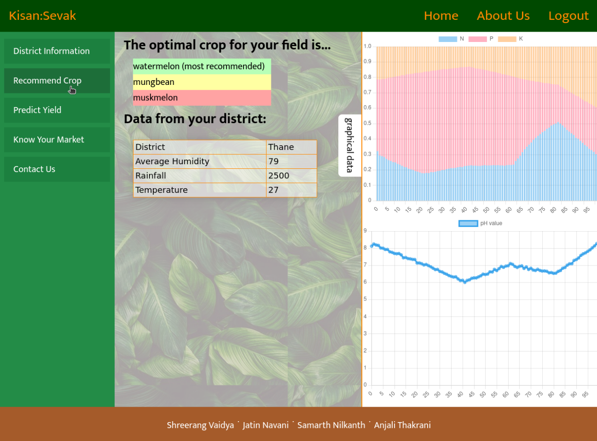
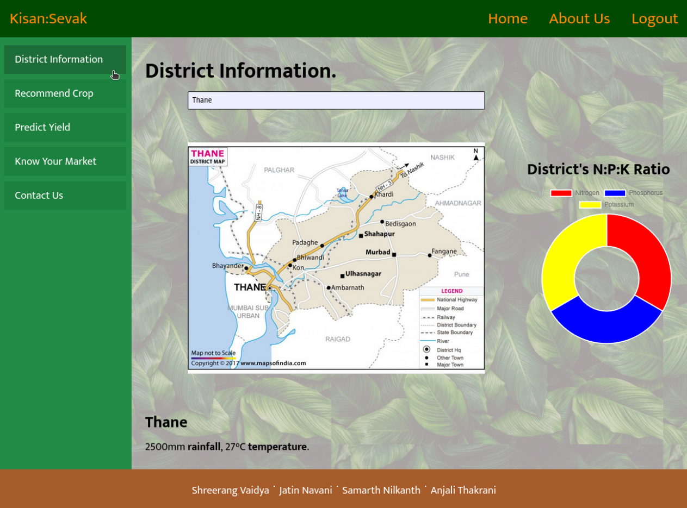
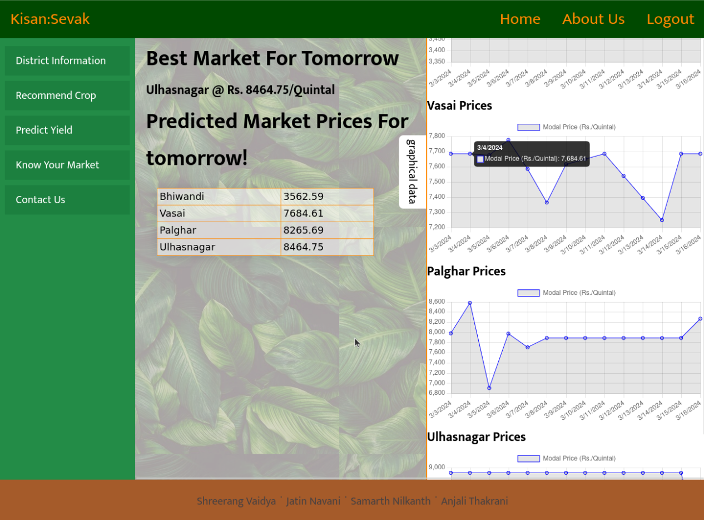

# Welcome to Fresh-Fields, aka, KisanSevak
Refer to the [report](./report.pdf) for a detailed report.






## Setup
1. Clone all dependencies 
```sh
rm -rf sensor
git clone git@github.com:Fresh-Fields/sensor-module-pseudo.git sensor
rm -rf ml
git clone git@github.com:Fresh-Fields/ml-official.git ml
rm -rf vite
git clone git@github.com:Fresh-Fields/frontent.git vite
```
2. Run `make`
3. Enjoy.
